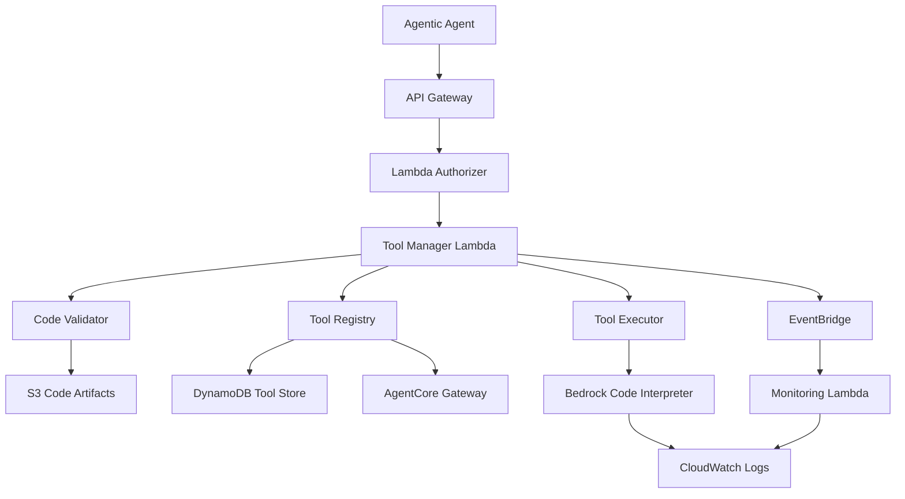

# Dynamic Tool Runtime Design Document

## Overview

The Dynamic Tool Runtime system is a serverless, AWS-native platform that enables agentic agents to dynamically create, validate, and execute custom tools at runtime. The system integrates with AWS AgentCore Gateway to provide seamless tool registration and invocation while maintaining strict security through sandboxed execution environments.

The architecture follows AWS Well-Architected Framework principles, emphasizing security, reliability, performance efficiency, cost optimization, and operational excellence.

## Architecture

### High-Level Architecture



### Component Architecture

The system is composed of six primary components:

1. **API Gateway Layer**: RESTful API endpoints for tool management
2. **Tool Manager**: Orchestrates tool lifecycle operations
3. **Code Validator**: Performs security and compliance validation
4. **Tool Registry**: Manages tool metadata and AgentCore integration
5. **Code Interpreter Executor**: Leverages Bedrock AgentCore Code Interpreter for secure execution
6. **Monitoring System**: Observability and audit capabilities

## Components and Interfaces

### API Gateway Layer

**Purpose**: Provides secure, scalable API endpoints for tool operations

**Endpoints**:
- `POST /tools` - Create new tool definition
- `GET /tools/{toolId}` - Retrieve tool metadata
- `PUT /tools/{toolId}` - Update existing tool
- `DELETE /tools/{toolId}` - Remove tool
- `POST /tools/{toolId}/execute` - Execute tool with parameters

**Security**: 
- AWS IAM authentication
- Request/response validation
- Rate limiting and throttling
- CORS configuration for web clients

### Tool Manager Lambda

**Purpose**: Central orchestrator for all tool lifecycle operations

**Responsibilities**:
- Check for existing cached tools before validation (content-based lookup)
- Coordinate validation, registration, and execution workflows
- Manage tool state transitions and cache invalidation
- Handle error scenarios and rollbacks
- Emit events for monitoring and audit
- Implement tool reuse and sharing across agents

**Interface**:
```typescript
interface ToolManager {
  createTool(definition: ToolDefinition): Promise<ToolMetadata>
  updateTool(toolId: string, definition: ToolDefinition): Promise<ToolMetadata>
  deleteTool(toolId: string): Promise<void>
  executeTool(toolId: string, parameters: Record<string, any>): Promise<ExecutionResult>
}
```

### Code Validator Component

**Purpose**: Ensures code safety and compliance before execution

**Validation Layers**:
1. **Syntax Analysis**: AST parsing and syntax validation
2. **Security Scanning**: Prohibited API and system call detection
3. **Resource Analysis**: Memory and CPU usage estimation
4. **Compliance Checking**: Policy and governance rule validation

**Implementation Libraries**:

**Python Validation**:
- **`ast`** (built-in) - Parse Python code into AST for syntax validation and analysis
- **`bandit`** - Industry-standard security-focused static analysis tool
- **`radon`** - Cyclomatic complexity and maintainability metrics
- Custom AST traversal for resource estimation and prohibited operation detection

**JavaScript/TypeScript Validation**:
- **`acorn`** - Fast, lightweight JavaScript parser
- **`eslint`** with **`eslint-plugin-security`** - Security-focused linting
- **`@typescript-eslint/parser`** - TypeScript AST parsing
- Custom AST traversal for resource estimation

**Validation Strategy**:
- Use built-in AST parsing for fast syntax validation (< 100ms)
- Run bandit security scans for Python code (< 200ms)
- Custom rule engine for domain-specific checks (< 100ms)
- Lightweight complexity analysis using AST metrics (< 100ms)
- **Total validation target: < 500ms**

**Prohibited Operations**:
- File system access outside temp directories
- Network operations (except approved APIs)
- Process spawning or system calls
- Dynamic code execution (eval, exec)
- Infinite loops or recursive calls
- Import of dangerous modules (os.system, subprocess, socket, etc.)

**Interface**:
```typescript
interface CodeValidator {
  validate(code: string, language: string): Promise<ValidationResult>
  estimateResources(code: string): Promise<ResourceEstimate>
}
```

### Tool Registry Component

**Purpose**: Manages tool metadata and AgentCore Gateway integration

**Storage Schema** (DynamoDB):
```typescript
interface ToolRecord {
  toolId: string              // Partition key
  agentId: string            // Global secondary index
  name: string
  description: string
  version: string
  status: 'active' | 'inactive' | 'deprecated'
  codeArtifactS3Key: string  // S3 key for validated code + metadata bundle
  schema: ToolSchema
  createdAt: string
  updatedAt: string
  executionCount: number
  lastExecuted?: string
}
```

**S3 Code Artifacts Purpose**:
- **Tool Caching**: Cache validated tools to avoid re-validation and re-processing
- **Code Deduplication**: Multiple agents can reuse identical tool implementations
- **Versioned Storage**: Immutable storage of validated tool code with version history
- **Performance Optimization**: Fast retrieval for AgentCore Code Interpreter execution
- **Content-Based Addressing**: Use code hash as S3 key to enable automatic deduplication
- **Validation Caching**: Store validation results alongside code to skip re-validation
- **Dependency Management**: Bundle code with resolved dependencies and metadata

**Caching Strategy**:
```typescript
interface CachedToolArtifact {
  codeHash: string           // SHA-256 of normalized code
  validatedCode: string      // Processed and validated code
  validationResult: ValidationResult
  dependencies: string[]     // Required libraries/packages
  executionMetadata: ExecutionMetadata
  createdAt: string
  usageCount: number        // Track reuse across agents
}
```

**Tool Lifecycle Workflows**:

**New Tool Creation**:
1. Agent submits new tool code → Hash code → Cache lookup
2. **Cache Miss**: Validate → Execute in Code Interpreter → Cache results → Register with AgentCore
3. Tool becomes available for immediate use and future reuse

**Existing Tool Reuse**:
1. Agent discovers existing tool via AgentCore Gateway tool registry
2. Agent invokes tool by toolId (no code submission needed)
3. System retrieves cached implementation and executes immediately

**Tool Execution** (both new and existing):
- All tools execute immediately when invoked
- Cached tools skip validation for faster execution
- Results returned to requesting agent through AgentCore Gateway

**Latency Optimization Benefits**:

**First-Time Tool Creation** (~2-5 seconds):
- Code validation: ~500ms
- AgentCore registration: ~200ms  
- Code Interpreter execution: ~1-3s
- S3 caching: ~100ms (async)

**Cached Tool Reuse** (~1-2 seconds):
- Skip validation: **-500ms saved**
- Skip registration: **-200ms saved**
- Direct Code Interpreter execution: ~1-2s
- Cache retrieval: ~50ms

**Tool Discovery** (~100-200ms):
- DynamoDB query for available tools
- No code processing or execution needed
- Immediate tool metadata return

**Cross-Agent Efficiency**:
- Agent A creates tool → 3s initial cost
- Agents B,C,D reuse same tool → 1s each (60% faster)
- Common utility tools become "instant" for the ecosystem

**AgentCore Integration**:
- Register tools with AgentCore Gateway API using Bedrock Agent APIs
- Leverage AgentCore's native tool discovery and routing
- Integrate with existing AgentCore tool lifecycle management
- Use AgentCore's built-in tool versioning and metadata system
- Utilize AgentCore Code Interpreter for secure execution

### Sandbox Executor Component

**Purpose**: Provides secure, isolated execution environment for dynamic tools using AWS Bedrock AgentCore Code Interpreter

**Execution Environment**:
- AWS Bedrock AgentCore Code Interpreter Tool
- Pre-configured secure sandbox with Python/JavaScript runtime
- Managed resource limits and security policies
- Built-in file system isolation and network restrictions
- Automatic timeout and resource management

**AgentCore Code Interpreter Integration**:
- Leverage existing secure execution environment
- Built-in support for common libraries and packages
- Automatic result serialization and error handling
- Native integration with AgentCore Gateway
- Managed scaling and resource optimization

**Interface**:
```typescript
interface SandboxExecutor {
  executeWithCodeInterpreter(code: string, parameters: Record<string, any>): Promise<ExecutionResult>
  registerToolWithAgentCore(toolDefinition: ToolDefinition): Promise<string>
  validateExecution(toolId: string): Promise<boolean>
}
```

### Monitoring System

**Purpose**: Provides comprehensive observability and audit capabilities

**Metrics Tracked**:
- Tool creation/deletion rates
- Validation success/failure rates
- Execution performance and errors
- Resource utilization patterns
- Security violation attempts

**Logging Strategy**:
- Structured JSON logging
- CloudWatch Logs integration
- X-Ray distributed tracing
- Custom metrics and dashboards

## Data Models

### Tool Definition Schema

```typescript
interface ToolDefinition {
  name: string
  description: string
  version: string
  language: 'python' | 'javascript' | 'typescript'
  code: string
  schema: {
    parameters: Record<string, ParameterSchema>
    returns: ReturnSchema
  }
  metadata?: Record<string, any>
}

interface ParameterSchema {
  type: string
  description: string
  required: boolean
  default?: any
  validation?: ValidationRule[]
}
```

### Execution Result Schema

```typescript
interface ExecutionResult {
  toolId: string
  executionId: string
  status: 'success' | 'error' | 'timeout'
  result?: any
  error?: {
    type: string
    message: string
    stack?: string
  }
  metrics: {
    duration: number
    memoryUsed: number
    cpuTime: number
  }
  timestamp: string
}
```

## Error Handling

### Error Categories

1. **Validation Errors**: Code syntax, security, or compliance violations
2. **Execution Errors**: Runtime failures, timeouts, or resource exhaustion
3. **System Errors**: Infrastructure failures or service unavailability
4. **Integration Errors**: AgentCore Gateway communication failures

### Error Response Strategy

- Structured error responses with error codes
- Detailed error messages for debugging
- Retry logic for transient failures
- Circuit breaker pattern for downstream services
- Graceful degradation for non-critical features

### Rollback Mechanisms

- Tool registration rollback on validation failure
- Execution state cleanup on timeout or error
- AgentCore Gateway deregistration on tool deletion
- Audit trail maintenance for all operations

## Testing Strategy

### Unit Testing
- Individual component logic validation
- Mock external dependencies (AWS services)
- Code coverage targets: 90%+ for critical paths
- Property-based testing for validation logic

### Integration Testing
- End-to-end workflow validation
- AWS service integration testing
- AgentCore Gateway integration testing
- Performance and load testing

### Security Testing
- Penetration testing for sandbox escape attempts
- Code injection and XSS vulnerability testing
- Authentication and authorization testing
- Compliance validation testing

### Monitoring and Alerting
- Real-time performance monitoring
- Security violation detection and alerting
- Resource utilization tracking
- Error rate and latency monitoring